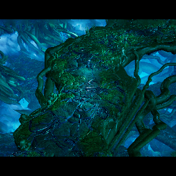
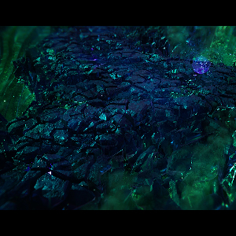
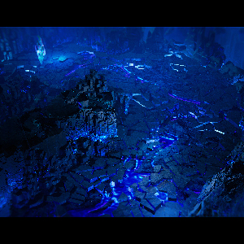
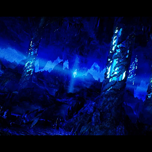
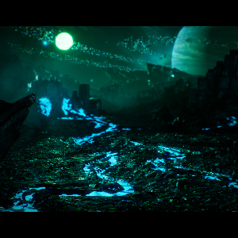
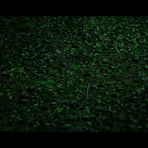
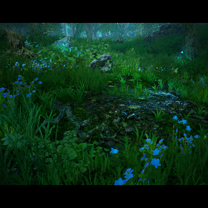

# <a href="https://corvaeoboro.github.io/"> https://corvaeoboro.github.io/</a>

<table>

<tr>
<td></td>
<td></td>
<td></td>
<td></td>
<td></td>
</tr>

<tr>
<td></td>
<td></td>
<td></td>
<td></td>
<td></td>
</tr>

</table>